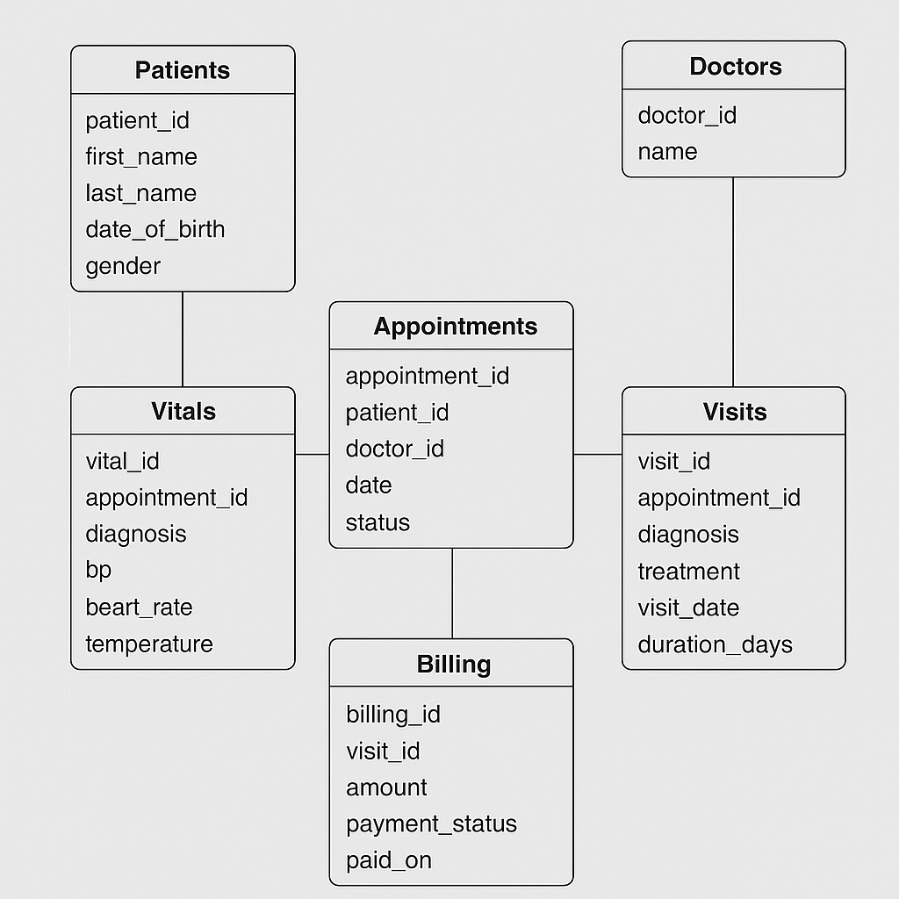

# 🏥 HealthTrackSQL

**HealthTrackSQL** is an advanced SQL-based healthcare data management and analytics system for a multi-specialty hospital. This project demonstrates normalized database design, data generation, complex queries, automation with triggers and stored procedures, and exporting analytical insights.

---

## 📊 ER Diagram 



---
## 📁 Project Structure

| Component          | Description                                     |
|--------------------|-------------------------------------------------|
| `patients.sql`     | Table + 50 sample patients                      |
| `doctors.sql`      | Table + 10 sample doctors                       |
| `appointments.sql` | 100 appointments (FK: patients & doctors)       |
| `visits.sql`       | 100 visit records linked to appointments        |
| `vitals.sql`       | 300 vital measurements (BP, Temp, HR)           |
| `billing.sql`      | 100 billing entries tied to visits              |
| `views.sql`        | Reusable views for analytics                    |
| `triggers.sql`     | Triggers for real-time alerts on vitals         |
| `procedures.sql`   | Stored procedures for patient summaries         |

---

## 🔍 Key Features

- ✅ Fully normalized healthcare relational schema
- 🔁 Real-time alert system using **AFTER INSERT trigger**
- 🧠 Reusable **views** for diagnosis and revenue analytics
- ⚙️ Custom **stored procedures** for patient-level visit summary
- 📈 Analytical queries for operations & clinical insights
- 📤 CSV export of results for reporting / GitHub use

---

## 📌 Sample Use Case Queries

 1. Top Diagnoses
```sql
SELECT diagnosis, COUNT(*) FROM Visits GROUP BY diagnosis ORDER BY COUNT(*) DESC;
```
2. Doctor with Most Patients
```sql
SELECT d.name, COUNT(DISTINCT a.patient_id)
FROM Appointments a JOIN Doctors d ON a.doctor_id = d.doctor_id
GROUP BY d.name ORDER BY COUNT(*) DESC;
```
3. Abnormal Vital Alerts
```sql
SELECT * FROM Vitals_Alerts WHERE alert_type IN ('High BP', 'High Temperature');
```
4. Patient Visit History (ID = 10)
```sql
CALL sp_patient_visit_summary(10);
```

## ⚠️ Trigger Logic
Fires when vitals are inserted
If BP > 150 or Temp > 100 → logs to Vitals_Alerts

## 📥 Data Export
Sample analytical results exported as .csv for GitHub under /data_exports/

Uses Workbench or INTO OUTFILE method

## Tech Stack
💾 MySQL 8.0.42
🧠 SQL (DDL, DML, Views, Triggers, SPs)
🧮 Excel / CSV for reports

## How to Run

Clone or download repo
Execute create_tables.sql
Load sample data from each file
Run queries in Workbench or CLI
Explore Views, Stored Procedures, Triggers


## 🙌 Author

**Samartha**  
B.Tech student 
🎓 MySQL • AI/ML • Data Science •  NLP • Google Cloud 
🔗 [LinkedIn](https://www.linkedin.com/in/samartha-b0154a293) | [GitHub](https://github.com/Samartha21BRS1698)

📝 License
 MIT License © 2025 Samartha